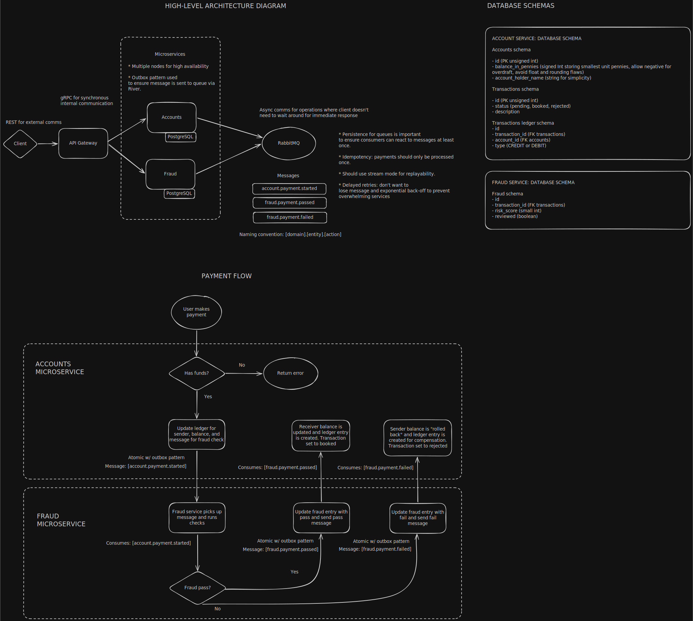

# Micro Transaction Ledger

Digital banking ledger for keeping track of transactions between accounts. 

TODO: add screenshot/GIF of UI demo

## Basic requirements
- Payments between accounts
- Audit trail - ledger with immutable entries
- Account balance tracking/retrieval
- Simple transaction statuses with reasoning; Pending, Rejected, Authorised
- Demo UI for sending payments and for visualisation purposes
- Concepts to implement: microservices, choreographed saga pattern (async messaging), idempotency, delayed retries, gRPC, context, optimistic updates?, dead letter queues? etc

## Design

TODO: add architecture diagram, design choices (high level), techstack, note UI is for demo only



## Trade-offs

TODO: explain trade-offs, cap theorem etc

## Running the ledger

TODO: setup, prerequisites (docker), running etc

## Testing

TODO: unit testing, coverage, additional strategies etc

## Development

Accessing RabbitMQ dashboard: `http://localhost:8080/queue`
- Username: guest
- Password: guest

TODO: talk about sqlc

```bash
sqlc generate
```

Import cycles: godepgraph and go list

```bash
go list -f '{{.ImportPath}} -> {{.Imports}}' ./...

# to clean out ouput use -p to ignore prefixes (comma separated)
godepgraph -s -novendor -p golang.org,gopkg.in,google.golang.org,go.,github.com/r,github.com/j,github.com/g ./cmd/ | dot -Tpng -o dependencies.png
```

TODO: might need to rebuild container when making seed/migration changes for now - use proper tool later.

## Future additions

TODO: known issues, features to add next, 

- no authentication or authorisation for simplicity as the focus was on general system design techniques listed at top of README. Could revisit to add.
- currency GBP assumed


## Useful docs/reading material
* Dealing with currency: https://cardinalby.github.io/blog/post/best-practices/storing-currency-values-data-types/#1-integer-number-of-minor-units
* RabbitMQ intro: https://www.rabbitmq.com/tutorials/tutorial-one-go
* RabbitMQ pub/sub and exchanges: https://www.rabbitmq.com/tutorials/tutorial-three-go
* River docs: https://riverqueue.com/docs
* Postgres constraints: https://www.postgresql.org/docs/current/ddl-constraints.html
* Golang DB access: https://www.alexedwards.net/blog/organising-database-access

## Dev TODO List

- [ ] Build simple UI for demo/visualisation purposes
- [ ] Ensure payments are idempotent
- [ ] Add retry mechanisms
- [ ] Utilise Goroutines where appropriate
- [ ] Use context appropriately
- [ ] Unit test coverage
- [ ] Update services to use gRPC (internal comms only)

```bash
curl -i -X POST http://localhost:8080/accounts/payment -d '{"AmountInPennies":1000,"senderAccountId": 1, "receiverAccountId": 3}'

curl -i -X GET http://localhost:8080/accounts/1
```
